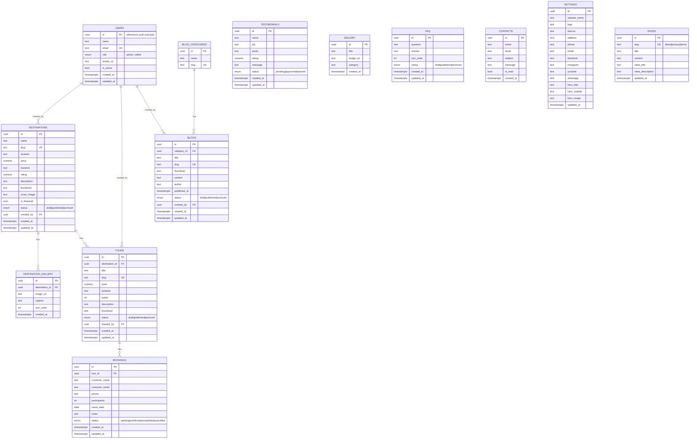
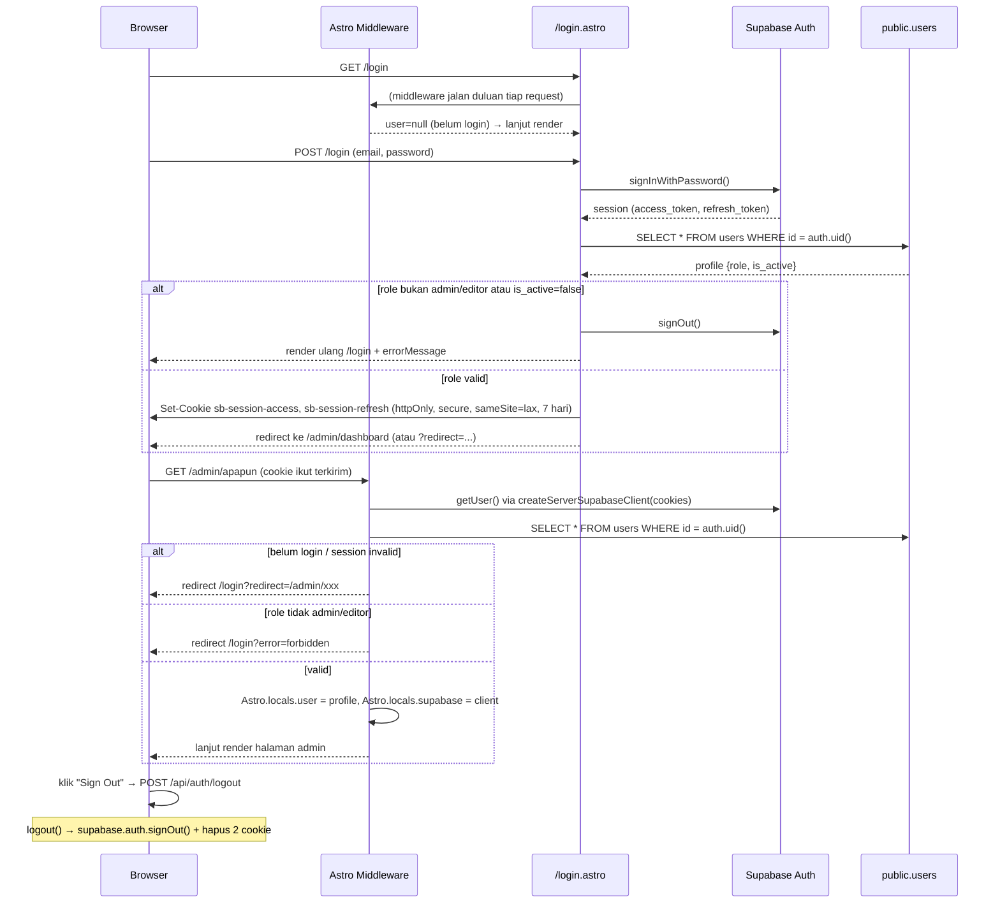
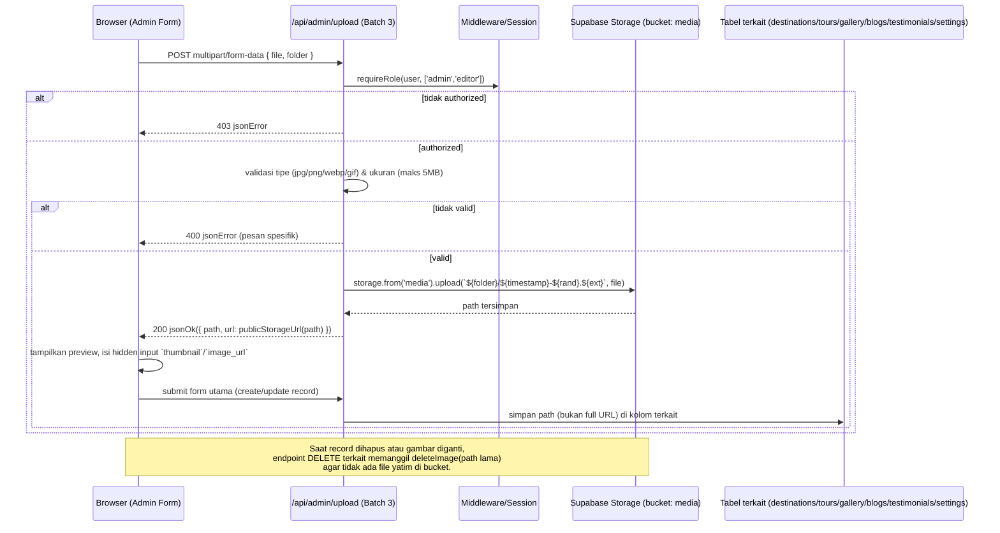
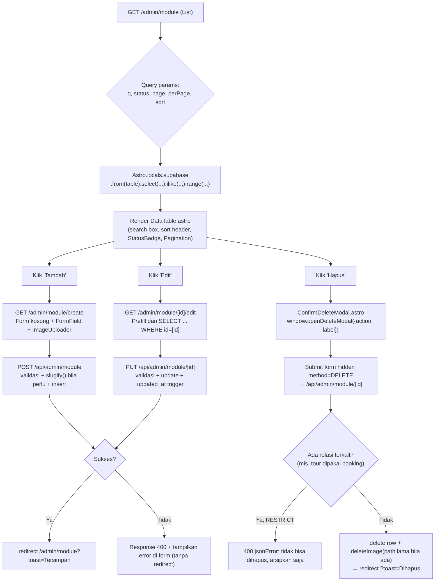

# ARSITEKTUR PROJECT — Travel Management (TravelTime + PowerAdmin)

> Dokumen ini adalah *source of truth* arsitektur. Ditulis berdasarkan kode yang **sudah ada di Batch 1** (bukan rencana terpisah), dan menjadi acuan wajib untuk Batch 2–4 agar tidak ada penyimpangan struktur di tengah jalan.
>
> Status: **Batch 1 selesai** (scaffold, database, auth, layout, dashboard awal). Dokumen ini memetakan apa yang **akan** dibangun di Batch 2 (frontend) & Batch 3 (admin CRUD + API) berdasarkan fondasi yang sudah ditanam.

---

## 1. Mapping Halaman TravelTime → Astro Pages

Semua halaman publik dirender lewat `PublicLayout.astro` (sudah ada), server-rendered (`output: 'server'`), data selalu dari Supabase — tidak ada dummy content.

| # | Halaman Template (.html) | Route Astro | File | Sumber Data | Status |
|---|---|---|---|---|---|
| 1 | `index.html` | `/` | `src/pages/index.astro` | `settings`, `destinations` (featured), `tours` (populer), `testimonials` (approved), `blogs` (terbaru) | Batch 1 (versi minimal) → **disempurnakan Batch 2** |
| 2 | `about.html` | `/about` | `src/pages/about.astro` | `pages` (slug='about'), `settings` | Batch 2 |
| 3 | `destinations.html` | `/destinations` | `src/pages/destinations/index.astro` | `destinations` (status='published') + search/filter/pagination | Batch 2 |
| 4 | `destination-details.html` | `/destinations/[slug]` | `src/pages/destinations/[slug].astro` | `destinations` by slug + `destination_gallery` + `tours` terkait | Batch 2 |
| 5 | `tours.html` | `/tours` | `src/pages/tours/index.astro` | `tours` (status='published') join `destinations` + filter/pagination | Batch 2 |
| 6 | `tour-details.html` | `/tours/[slug]` | `src/pages/tours/[slug].astro` | `tours` by slug join `destinations` | Batch 2 |
| 7 | `booking.html` | `/booking` | `src/pages/booking/index.astro` | Form → insert ke `bookings`; dropdown tour dari `tours` | Batch 2 |
| 8 | (konfirmasi booking) | `/booking/success` | `src/pages/booking/success.astro` | State via query param setelah insert sukses | Batch 2 |
| 9 | `gallery.html` | `/gallery` | `src/pages/gallery.astro` | `gallery` + filter kategori (isotope.js tetap dipakai) | Batch 2 |
| 10 | `testimonials.html` | `/testimonials` | `src/pages/testimonials.astro` | `testimonials` (status='approved') + form submit testimonial baru (status='pending') | Batch 2 |
| 11 | `blog.html` | `/blog` | `src/pages/blog/index.astro` | `blogs` (status='published') join `blog_categories` + pagination | Batch 2 |
| 12 | `blog-details.html` | `/blog/[slug]` | `src/pages/blog/[slug].astro` | `blogs` by slug + related posts by category | Batch 2 |
| 13 | `faq.html` | `/faq` | `src/pages/faq.astro` | `faq` (status='published') order by `sort_order` | Batch 2 |
| 14 | `contact.html` | `/contact` | `src/pages/contact.astro` | Form → insert ke `contacts`; info dari `settings` | Batch 2 |
| 15 | `privacy.html` | `/privacy` | `src/pages/privacy.astro` | `pages` (slug='privacy') | Batch 2 |
| 16 | `terms.html` | `/terms` | `src/pages/terms.astro` | `pages` (slug='terms') | Batch 2 |
| 17 | `404.html` | (catch-all) | `src/pages/404.astro` | Statis | Batch 2 |

Folder `src/pages/blog/`, `destinations/`, `tours/`, `booking/` **sudah dibuat kosong di Batch 1** — Batch 2 mengisi file di dalamnya, konsisten dengan struktur di `PROMPT` awal.

---

## 2. Mapping Halaman PowerAdmin → Astro Admin Pages

Semua halaman admin dirender lewat `AdminLayout.astro` (sudah ada), dilindungi `src/middleware.ts` (sudah ada — redirect ke `/login` jika belum autentikasi).

| # | Halaman Template (.html) | Route Astro | File | Tabel Utama | Status |
|---|---|---|---|---|---|
| 1 | `auth-login.html` | `/login` | `src/pages/login.astro` | `auth.users` via Supabase Auth | **Selesai (Batch 1)** |
| 2 | `dashboard-*.html` (disederhanakan) | `/admin/dashboard` | `src/pages/admin/dashboard.astro` | Agregat count dari beberapa tabel | **Selesai (Batch 1)** |
| 3 | `users.html`, `users-edit.html`, `users-view.html` → CRUD destinasi | `/admin/destinations`, `/admin/destinations/create`, `/admin/destinations/[id]/edit` | `src/pages/admin/destinations/*.astro` | `destinations`, `destination_gallery` | Batch 3 |
| 4 | (pola tabel serupa) | `/admin/tours`, `/admin/tours/create`, `/admin/tours/[id]/edit` | `src/pages/admin/tours/*.astro` | `tours` | Batch 3 |
| 5 | `apps-file-manager.html` (pola grid+upload) | `/admin/gallery`, `/admin/gallery/create` | `src/pages/admin/gallery/*.astro` | `gallery` | Batch 3 |
| 6 | `tables-basic.html` (pola tabel + moderasi) | `/admin/testimonials` | `src/pages/admin/testimonials/index.astro` | `testimonials` (approve/reject) | Batch 3 |
| 7 | `tables-basic.html` (pola tabel + reorder) | `/admin/faq`, `/admin/faq/create` | `src/pages/admin/faq/*.astro` | `faq` | Batch 3 |
| 8 | `invoice-list.html` (pola tabel + status) | `/admin/bookings`, `/admin/bookings/[id]` | `src/pages/admin/bookings/*.astro` | `bookings` join `tours` | Batch 3 |
| 9 | `apps-contacts.html` (pola tabel + read/unread) | `/admin/contacts` | `src/pages/admin/contacts/index.astro` | `contacts` | Batch 3 |
| 10 | `forms-editors.html` (Quill) | `/admin/blogs/categories`, `/admin/blogs`, `/admin/blogs/create`, `/admin/blogs/[id]/edit` | `src/pages/admin/blogs/*.astro` | `blog_categories`, `blogs` | Batch 3 |
| 11 | `settings.html` | `/admin/settings` | `src/pages/admin/settings/index.astro` | `settings` (single row) | Batch 3 |
| 12 | `blank.html` (editor konten) | `/admin/settings/about`, `/admin/settings/privacy`, `/admin/settings/terms` | `src/pages/admin/settings/[slug].astro` | `pages` | Batch 3 |
| 13 | `users.html` | `/admin/users`, `/admin/users/create`, `/admin/users/[id]/edit` | `src/pages/admin/users/*.astro` | `public.users` + `auth.admin` API (service role) | Batch 3 |
| 14 | `profile.html` | `/admin/profile` | `src/pages/admin/profile.astro` | `public.users` (baris milik sendiri) | Batch 3 |

Halaman demo PowerAdmin yang **tidak dipakai** (Calendar, Chat, Email, Todo, Kanban, Activity, Support, semua `dashboard-*` selain Dashboard utama, semua `components-*`/`icons-*`/`widgets-*` demo) — sesuai instruksi awal, tidak dibuatkan route.

Folder `src/pages/admin/blogs/`, `bookings/`, `destinations/`, `faq/`, `gallery/`, `settings/`, `testimonials/`, `tours/`, `users/` **sudah dibuat kosong di Batch 1**.

---

## 3. Daftar Reusable Components

### Sudah ada (Batch 1)

| Komponen | Path | Fungsi |
|---|---|---|
| `SeoHead.astro` | `src/components/SeoHead.astro` | Meta title/description/canonical/OpenGraph/Twitter Card, dipakai `PublicLayout` |
| `Header.astro` | `src/components/user/Header.astro` | Navbar publik, dinamis dari `settings` + highlight menu aktif |
| `Footer.astro` | `src/components/user/Footer.astro` | Footer publik, dinamis dari `settings` (alamat, kontak, social links) |
| `AdminSidebar.astro` | `src/components/admin/AdminSidebar.astro` | Sidebar dashboard, grup collapsible (Master Data, Blog, Website), aktif berdasar `Astro.url.pathname` |
| `AdminHeader.astro` | `src/components/admin/AdminHeader.astro` | Topbar admin: user dropdown, logout, link ke website |
| `PageHeader.astro` | `src/components/admin/PageHeader.astro` | Judul halaman + breadcrumb + slot tombol aksi (dipakai semua halaman admin Batch 3) |
| `Toast.astro` | `src/components/shared/Toast.astro` | Notifikasi toast global (event `app:toast` atau query param `?toast=`) |
| `ConfirmDeleteModal.astro` | `src/components/shared/ConfirmDeleteModal.astro` | Modal konfirmasi hapus generik (`window.openDeleteModal({action, label})`) |

### Akan ditambahkan (Batch 2 — komponen publik)

| Komponen | Rencana Path | Fungsi |
|---|---|---|
| `DestinationCard.astro` | `components/user/DestinationCard.astro` | Card destinasi (dipakai Home, Destinations, related) |
| `TourCard.astro` | `components/user/TourCard.astro` | Card tour (dipakai Home, Tours, Destination Detail) |
| `BlogCard.astro` | `components/user/BlogCard.astro` | Card artikel blog |
| `TestimonialCard.astro` | `components/user/TestimonialCard.astro` | Card testimoni (swiper slide) |
| `GalleryItem.astro` | `components/user/GalleryItem.astro` | Item grid gallery + lightbox trigger |
| `FaqAccordion.astro` | `components/user/FaqAccordion.astro` | Accordion FAQ |
| `Breadcrumb.astro` | `components/user/Breadcrumb.astro` | Breadcrumb halaman detail publik |
| `Pagination.astro` | `components/shared/Pagination.astro` | Pagination generik (dipakai publik & admin) |
| `ContactForm.astro` | `components/user/ContactForm.astro` | Form kontak (submit ke `/api/public/contact`) |
| `BookingForm.astro` | `components/user/BookingForm.astro` | Form booking (submit ke `/api/public/booking`) |
| `TestimonialForm.astro` | `components/user/TestimonialForm.astro` | Form kirim testimoni |

### Akan ditambahkan (Batch 3 — komponen admin)

| Komponen | Rencana Path | Fungsi |
|---|---|---|
| `DataTable.astro` | `components/admin/DataTable.astro` | Wrapper tabel generik: search, sort header, pagination footer (dipakai semua list CRUD) |
| `ImageUploader.astro` | `components/admin/ImageUploader.astro` | Input file + preview + progress, panggil helper `uploadImage()` |
| `StatusBadge.astro` | `components/admin/StatusBadge.astro` | Badge warna per status (`draft/published/archived`, `pending/confirmed/completed/cancelled`, `pending/approved/rejected`) |
| `RichTextEditor.astro` | `components/admin/RichTextEditor.astro` | Wrapper Quill untuk field `content` (blog, pages) |
| `EmptyState.astro` | `components/admin/EmptyState.astro` | Tampilan saat data kosong |
| `FormField.astro` | `components/admin/FormField.astro` | Wrapper label + input + invalid-feedback konsisten |

---

## 4. Struktur Layouts

```
src/layouts/
├── PublicLayout.astro   # Sudah ada — bungkus semua halaman TravelTime
│   Props: { title, description?, image?, bodyClass?, noindex? }
│   - Fetch `settings` sekali (untuk Header/Footer/SEO)
│   - Render <SeoHead>, <Header>, <slot /> di dalam <main class="main">, <Footer>
│   - Load CSS/JS vendor dari /assets-user/*
│
└── AdminLayout.astro    # Sudah ada — bungkus semua halaman /admin/*
    Props: { title }
    - Ambil `user` dari Astro.locals.user (diisi middleware)
    - Render <AdminHeader>, <AdminSidebar>, <main><div class="main-content"><slot /></div></main>
    - Render <Toast /> global
    - Load CSS/JS vendor dari /assets-admin/*
```

Tidak ada layout tambahan di Batch 2/3 — form create/edit admin cukup pakai `AdminLayout` + komponen `PageHeader` + `FormField`.

---

## 5. Struktur Routing

```
/                              → Home (published data only)
/about                         → About (pages.slug='about')
/destinations                  → List + filter/search/pagination
/destinations/[slug]           → Detail
/tours                         → List + filter/search/pagination
/tours/[slug]                  → Detail
/booking                       → Form booking (?tour=slug prefill opsional)
/booking/success               → Konfirmasi
/gallery                       → Grid + filter kategori
/testimonials                  → List approved + form submit
/blog                          → List + pagination
/blog/[slug]                   → Detail + related
/faq                           → Accordion
/contact                       → Form
/privacy                       → pages.slug='privacy'
/terms                         → pages.slug='terms'
/login                         → Form login (sudah ada)
404                             → Not found (sudah ada bawaan Astro jika dibuat src/pages/404.astro)

/admin/dashboard                        → sudah ada
/admin/destinations                     → list
/admin/destinations/create              → form create
/admin/destinations/[id]/edit           → form edit
/admin/tours                            → list
/admin/tours/create                     → form create
/admin/tours/[id]/edit                  → form edit
/admin/gallery                          → grid + upload
/admin/gallery/create                   → form create
/admin/testimonials                     → list + moderasi (approve/reject)
/admin/faq                              → list + reorder
/admin/faq/create                       → form create
/admin/faq/[id]/edit                    → form edit
/admin/bookings                         → list + filter status
/admin/bookings/[id]                    → detail + ubah status
/admin/contacts                         → list pesan masuk
/admin/blogs/categories                 → list + inline create kategori
/admin/blogs                            → list artikel
/admin/blogs/create                     → form create (Quill editor)
/admin/blogs/[id]/edit                  → form edit
/admin/settings                         → form pengaturan situs (single row)
/admin/settings/about                   → editor halaman About
/admin/settings/privacy                 → editor halaman Privacy
/admin/settings/terms                   → editor halaman Terms
/admin/users                            → list (khusus role admin)
/admin/users/create                     → form create (khusus role admin)
/admin/users/[id]/edit                  → form edit (khusus role admin)
/admin/profile                          → edit profil sendiri

/api/auth/logout            [GET|POST]  → sudah ada
/api/auth/login              [POST]     → (opsional, saat ini login lewat form POST langsung di /login.astro)
/api/public/booking          [POST]     → Batch 2
/api/public/contact          [POST]     → Batch 2
/api/public/testimonial      [POST]     → Batch 2
/api/admin/destinations      [POST|PUT|DELETE]        → Batch 3
/api/admin/destinations/[id]/gallery [POST|DELETE]    → Batch 3
/api/admin/tours             [POST|PUT|DELETE]        → Batch 3
/api/admin/gallery           [POST|DELETE]            → Batch 3
/api/admin/testimonials/[id] [PATCH|DELETE]           → Batch 3
/api/admin/faq               [POST|PUT|DELETE]        → Batch 3
/api/admin/faq/reorder       [POST]                   → Batch 3
/api/admin/bookings/[id]     [PATCH|DELETE]           → Batch 3
/api/admin/contacts/[id]     [PATCH|DELETE]           → Batch 3
/api/admin/blogs             [POST|PUT|DELETE]        → Batch 3
/api/admin/blog-categories   [POST|PUT|DELETE]        → Batch 3
/api/admin/settings          [PUT]                    → Batch 3
/api/admin/pages/[slug]      [PUT]                    → Batch 3
/api/admin/users             [POST|PUT|DELETE]        → Batch 3 (service role)
/api/admin/profile           [PUT]                    → Batch 3
/api/admin/upload            [POST]                   → Batch 3 (generic image upload)
```

Konvensi: route dinamis pakai `[slug]` untuk halaman publik (SEO-friendly), `[id]` (UUID) untuk halaman admin.

---

## 6. Diagram Relasi Database (ERD)

Sesuai `supabase/migrations/0001_init_schema.sql` (Batch 1):



Catatan penting (konsisten dengan `0001_init_schema.sql` & `0002_rls_policies.sql`):
- `users` **bukan** tabel auth mandiri — 1:1 dengan `auth.users` via trigger `handle_new_auth_user`, tidak menyimpan password.
- `bookings.tour_id` pakai `ON DELETE RESTRICT` (tour dengan booking tidak bisa dihapus langsung — harus diarsipkan via `status='archived'`).
- `tours.destination_id` dan `destinations.created_by` / `tours.created_by` / `blogs.created_by` pakai `ON DELETE SET NULL`.
- Semua tabel konten publik punya index `gin_trgm_ops` untuk pencarian cepat (`name`/`title` ILIKE).
- `settings` dibatasi 1 baris lewat unique index `((true))`.

---

## 7. Alur Autentikasi

Komponen yang sudah ada: `src/lib/auth.ts`, `src/lib/supabase.ts`, `src/middleware.ts`, `src/pages/login.astro`, `src/pages/api/auth/logout.ts`.



Poin desain kunci:
- Password **tidak pernah** disimpan di tabel `public.users` — sepenuhnya didelegasikan ke Supabase Auth (`auth.users`), sesuai catatan di migration.
- Middleware (`src/middleware.ts`) berjalan di **setiap request**, menempelkan `context.locals.supabase` (client yang membawa token user) supaya semua page/API tidak perlu re-create client.
- RLS di database jadi lapisan pertahanan kedua — bahkan jika middleware ter-bypass, query ke tabel `destinations`/`tours`/dll tetap tunduk pada `is_staff()` / `is_admin()`.
- Role `editor` boleh akses semua modul CRUD kecuali `/admin/users` (dicek di `AdminSidebar.astro` dan akan di-hardcode ulang di setiap `src/pages/api/admin/users/*` Batch 3).

---

## 8. Alur Upload Gambar ke Supabase Storage

Helper yang sudah ada: `uploadImage()`, `deleteImage()`, `publicStorageUrl()` di `src/lib/helpers.ts`. Bucket & policy sudah ada di `0003_storage_buckets.sql` (bucket `media`, public read, staff-only write).



Folder yang dipakai di bucket `media` (sudah didefinisikan di `helpers.ts` sebagai union type): `destination/`, `gallery/`, `blog/`, `logo/`, `testimonial/`, `hero/`.

Aturan yang **sudah berlaku** (RLS storage, `0003_storage_buckets.sql`):
- **Read**: publik (anon) boleh baca semua file di bucket `media` — dibutuhkan agar gambar tampil di website tanpa login.
- **Insert/Update/Delete**: hanya `is_staff()` (role admin/editor, `is_active=true`).

Pola pemakaian di form admin (Batch 3): setiap form create/edit punya komponen `ImageUploader.astro` yang upload dulu ke `/api/admin/upload` secara async (drag & drop / pilih file → langsung ke Storage), lalu simpan **path**-nya di hidden input; submit form utama baru menulis path itu ke kolom tabel (mis. `destinations.thumbnail`). Ini menghindari upload besar ikut ter-blok oleh validasi form lain.

---

## 9. Alur CRUD Setiap Menu Admin

Semua modul CRUD (Destinations, Tours, Gallery, Testimonials, FAQ, Bookings, Blog Categories, Blogs, Users, Settings, Pages) memakai **satu pola generik** yang sama, supaya konsisten (prinsip DRY dari instruksi awal):



Detail per fase:

1. **List (Read)** — server-rendered di `.astro` (bukan client fetch), pakai `Astro.locals.supabase` (RLS otomatis berlaku sebagai user login) supaya SEO/loading state konsisten dan sederhana. Search pakai `.ilike()` pada kolom ber-index trigram; sort/pagination pakai helper `parsePagination()` + `pageRange()` + `totalPages()` dari `helpers.ts`.
2. **Create/Update (Form)** — form HTML biasa (`method="post"`, tanpa JS framework, sesuai batasan "jangan pakai React/Vue/Svelte"), submit ke endpoint di `src/pages/api/admin/**`. Validasi server-side wajib (tidak percaya validasi HTML5 saja). Slug di-generate otomatis via `slugify()` dengan fallback `uniqueSlugSuffix()` jika konflik unique constraint.
3. **Upload gambar** — terintegrasi seperti dijelaskan di bagian 8, path gambar lama dihapus dari Storage saat diganti/dihapus (`deleteImage()`).
4. **Delete** — selalu lewat `ConfirmDeleteModal.astro` (sudah ada di Batch 1), method DELETE lewat hidden `_method` field (karena native HTML form tidak mendukung DELETE) yang dibaca API route.
5. **Toast** — setiap redirect setelah aksi sukses/gagal menambahkan `?toast=...&toastType=success|error`, otomatis ditangkap `Toast.astro` (sudah ada) dan URL dibersihkan via `history.replaceState`.
6. **Loading state** — tombol submit pakai atribut `disabled` + spinner Bootstrap saat form di-submit (native `formdata`/`submit` event listener kecil, tanpa framework).
7. **Error handling** — API route selalu balas JSON `{ success, data|error }` (helper `jsonOk`/`jsonError` sudah ada); untuk POST form biasa (non-fetch), API route melakukan `redirect` dengan query error alih-alih JSON supaya browser native form tetap berfungsi tanpa JavaScript wajib.

Pengecualian pola generik di atas:
- **Testimonials**: tidak ada form create dari admin (testimoni datang dari publik), admin hanya **approve/reject** (`PATCH`) + delete.
- **Bookings**: tidak ada create/delete manual dari admin (booking datang dari publik), admin hanya **ubah status** (`PATCH`) + lihat detail.
- **Settings** & **Pages** (about/privacy/terms): bukan list, langsung form edit single-row (`PUT`), tidak ada create/delete.
- **FAQ**: tambahan aksi *reorder* (`POST /api/admin/faq/reorder`) untuk drag-and-drop `sort_order`.
- **Users**: create/update memakai `createAdminSupabaseClient()` (service role) karena perlu memanggil Supabase Auth Admin API (`auth.admin.createUser`) — dibatasi hanya role `admin` (dicek `requireRole`).

---

## 10. Daftar API / Server Endpoints — Rencana Batch Berikutnya

### Batch 2 (Public API — form submission dari frontend)

| Method | Path | Fungsi | Tabel | Auth |
|---|---|---|---|---|
| POST | `/api/public/booking` | Simpan booking baru dari form `/booking` | `bookings` | Publik (RLS: insert-only) |
| POST | `/api/public/contact` | Simpan pesan dari form `/contact` | `contacts` | Publik (RLS: insert-only) |
| POST | `/api/public/testimonial` | Simpan testimoni baru (status='pending') | `testimonials` | Publik (RLS: insert pending-only) |
| POST | `/api/public/newsletter` | (opsional, jika footer form dipakai) | — | Publik |

### Batch 3 (Admin API — proteksi role admin/editor via `requireRole`)

| Method | Path | Fungsi |
|---|---|---|
| POST / PUT / DELETE | `/api/admin/destinations`, `/api/admin/destinations/[id]` | CRUD destinasi |
| POST / DELETE | `/api/admin/destinations/[id]/gallery` | Tambah/hapus foto galeri destinasi |
| POST / PUT / DELETE | `/api/admin/tours`, `/api/admin/tours/[id]` | CRUD tour |
| POST / DELETE | `/api/admin/gallery`, `/api/admin/gallery/[id]` | CRUD item gallery umum |
| PATCH / DELETE | `/api/admin/testimonials/[id]` | Approve/reject/hapus testimoni |
| POST / PUT / DELETE | `/api/admin/faq`, `/api/admin/faq/[id]` | CRUD FAQ |
| POST | `/api/admin/faq/reorder` | Update `sort_order` massal |
| PATCH | `/api/admin/bookings/[id]` | Ubah status booking |
| PATCH / DELETE | `/api/admin/contacts/[id]` | Tandai dibaca / hapus pesan kontak |
| POST / PUT / DELETE | `/api/admin/blog-categories`, `/api/admin/blog-categories/[id]` | CRUD kategori blog |
| POST / PUT / DELETE | `/api/admin/blogs`, `/api/admin/blogs/[id]` | CRUD artikel blog |
| PUT | `/api/admin/settings` | Update pengaturan situs (single row) |
| PUT | `/api/admin/pages/[slug]` | Update halaman statis (about/privacy/terms) |
| POST / PUT / DELETE | `/api/admin/users`, `/api/admin/users/[id]` | CRUD user (khusus role admin, pakai service role client) |
| PUT | `/api/admin/profile` | Update profil sendiri (nama, avatar) |
| POST | `/api/admin/upload` | Upload gambar generik ke Supabase Storage (dipakai semua modul) |
| DELETE | `/api/admin/upload` | Hapus file dari Storage (dipanggil saat ganti/hapus gambar) |

### Sudah ada (Batch 1)

| Method | Path | Fungsi |
|---|---|---|
| GET / POST | `/api/auth/logout` | Logout, hapus cookie sesi |
| (form POST langsung) | `/login` | Login — logikanya di frontmatter `.astro`, bukan API route terpisah, karena perlu `Astro.redirect` langsung tanpa round-trip fetch |

Semua endpoint admin di atas **wajib**:
1. Ambil `user` dari `Astro.locals.user` (diisi middleware).
2. Panggil `requireRole(user, ['admin','editor'])` (atau `['admin']` khusus modul Users) sebelum operasi apa pun.
3. Gunakan `Astro.locals.supabase` (bukan service role) kecuali modul Users — supaya RLS tetap jadi lapisan pertahanan kedua.
4. Balas `jsonOk()`/`jsonError()` untuk request `fetch()`, atau `Astro.redirect(...&toast=...)` untuk submit form native.

---

## Kesimpulan Konsistensi

Semua mapping di atas **hanya menjelaskan file yang sudah dibuat foldernya di Batch 1 dan konvensi lib yang sudah ada** (`supabase.ts`, `auth.ts`, `helpers.ts`, `database.types.ts`, `middleware.ts`) — tidak ada perubahan struktur folder, tidak ada tabel baru, tidak ada dependency baru. Batch 2 akan mengisi halaman publik + 3 API publik di atas. Batch 3 akan mengisi seluruh halaman admin + API admin di atas, mengikuti pola generik di Bagian 9.
